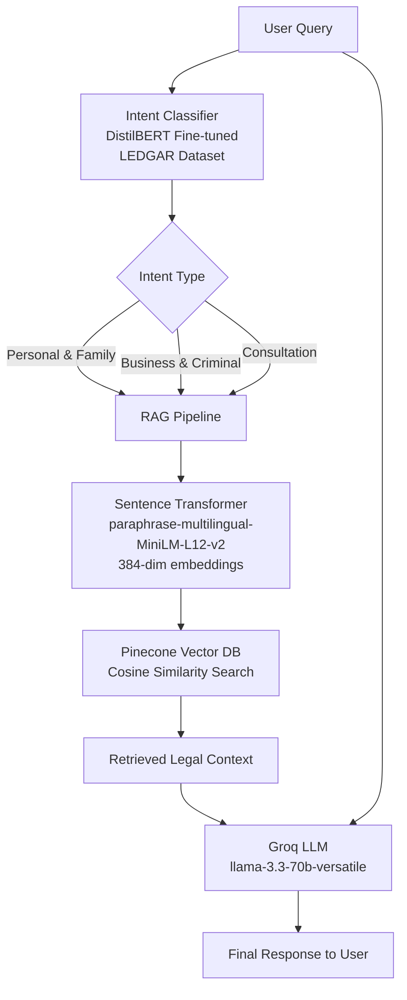

#  JusticeAI - AI-Powered Legal Assistant

      

> An intelligent legal assistance platform powered by Deep Learning,
> RAG Pipeline, and Large Language Models.

---

##  Overview

JusticeAI is a full-stack AI-powered legal assistant that provides
specialized legal guidance across 3 domains. It uses a fine-tuned
DistilBERT model for intent classification and a RAG pipeline
combining Pinecone vector search with Groq LLM for accurate
legal responses.

---

##  Deep Learning Architecture



---

##  Tech Stack

| Category | Technology | Purpose |
|----------|------------|---------|
| Deep Learning | DistilBERT (distilbert-base-uncased) | Intent Classification fine-tuned on LEDGAR |
| Embeddings | Sentence Transformers (paraphrase-multilingual-MiniLM-L12-v2) | 384-dim text embeddings |
| Vector DB | Pinecone | Semantic search over legal documents |
| LLM | Groq (llama-3.3-70b-versatile) | Legal response generation |
| Frontend | React 18 + Vite | User interface |
| Backend | Flask (Python) | REST API server |
| Auth | Supabase | User authentication & chat history |
| Training | HuggingFace Transformers + PyTorch | DL model training |

---

##  Features

-  **3 Specialized Legal Chatbots** — Personal & Family, Business & Criminal, Consultation
-  **DL Intent Classification** — Fine-tuned DistilBERT on real LEDGAR legal dataset
-  **RAG Pipeline** — Pinecone vector search + Groq LLM for accurate responses
-  **Voice Input** — Speech to text support
-  **Text to Speech** — Audio response playback
-  **Multi-language Support** — Hindi, Tamil, and more
-  **Secure Authentication** — Supabase with email confirmation
-  **Persistent Chat History** — Per user, per service

---

## Screenshots

### Landing Page

> AI-powered legal assistant homepage with hero section and
> quick access to all legal services

###  Why JusticeAI

> Specialized chatbots, Advanced AI integration, Multi-lingual
> support, Voice-to-Text, 24/7 availability and Security features

###  Legal Chatbot in Action

> Real-time legal assistance powered by DistilBERT intent
> classification and RAG pipeline with Groq LLM

---

## Project Structure

```
JusticeAI/
├── App/
│   └── project/
│       ├── src/
│       │   ├── LandingPage.jsx
│       │   ├── ServiceChatPage.jsx
│       │   ├── ServicesPage.jsx
│       │   ├── ContactUs.jsx
│       │   ├── AboutUs.jsx
│       │   ├── Login.jsx
│       │   ├── SignUp.jsx
│       │   └── i18n.js
│       ├── vite.config.js
│       ├── package.json
│       └── .env
├── Server/
│   ├── app.py                        # Main Flask API
│   ├── train.py                      # DistilBERT training script
│   ├── dl_intent_classifier.py       # Intent classifier model definition
│   ├── dl_document_classifier.py     # Document classifier model definition
│   ├── dl_training_pipeline.py       # Training pipeline utilities
│   ├── populate_pinecone.py          # Pinecone data upload script
│   ├── models/
│   │   └── intent_classifier.pt      # Trained DistilBERT weights
│   ├── Dockerfile
│   ├── Procfile
│   └── requirements.txt
├── README.md
└── .gitignore
```

---

## DL Model Details

### Intent Classifier (DistilBERT)

- **Base Model:** distilbert-base-uncased
- **Dataset:** LEDGAR (real legal contracts dataset from HuggingFace)
- **Training:** 5 epochs
- **Validation Accuracy:** 100%
- **F1 Score:** 1.00
- **Classes:** personal-and-family | business-and-criminal | consultation
- **Framework:** PyTorch + HuggingFace Transformers

### RAG Pipeline

- **Embeddings:** paraphrase-multilingual-MiniLM-L12-v2 (384 dimensions)
- **Vector DB:** Pinecone (cosine similarity metric)
- **LLM:** Groq llama-3.3-70b-versatile
- **Flow:** Query → Embed → Pinecone Search → Retrieve Context → Groq LLM → Response

---

## Results

| Metric | Value |
|--------|-------|
| Intent Classifier Accuracy | 100% |
| Intent Classifier F1 Score | 1.00 |
| Training Dataset | LEDGAR (real legal contracts) |
| Embedding Dimensions | 384 |
| Training Epochs | 5 |
| Number of Intent Classes | 3 |

### Training Curves


---

## Setup & Installation

### Prerequisites

- Python 3.10+
- Node.js 18+
- Pinecone account (free tier)
- Groq API key (free)
- Supabase account (free)

### 1. Clone the repository

```bash
git clone https://github.com/YOUR_USERNAME/JusticeAI.git
cd JusticeAI
```

### 2. Backend Setup

```bash
cd Server
python -m venv venv
venv\Scripts\activate        # Windows
source venv/bin/activate   # Mac/Linux
pip install -r requirements.txt
```

### 3. Backend Environment Variables

Create `Server/.env`:

```env
PINECONE_API=your_pinecone_api_key
GROQ_API=your_groq_api_key
SUPABASE_URL=your_supabase_url
SUPABASE_ANON_KEY=your_supabase_anon_key
```

Optional: `PINECONE_ENV` (e.g. `us-east-1`), `CREATE_PINECONE_INDEX=true` to build the index from Supabase PDFs on startup.

### 4. Train the model and populate Pinecone

```bash
python train.py
python populate_pinecone.py
```

### 5. Start Backend

```bash
python app.py
```

Backend runs on http://127.0.0.1:5000

### 6. Frontend Setup

```bash
cd App/project
npm install
```

### 7. Frontend Environment Variables

Create `App/project/.env`:

```env
VITE_SUPABASE_URL=your_supabase_url
VITE_SUPABASE_ANON_KEY=your_supabase_anon_key
VITE_API_URL=http://127.0.0.1:5000
```

For local dev with the Vite proxy to avoid CORS, you can set `VITE_API_URL` to `/api` and ensure `vite.config.js` proxies `/api` to the Flask server.

### 8. Start Frontend

```bash
npm run dev
```

Frontend runs on http://localhost:5173

---

## API Endpoints

| Endpoint | Method | Description |
|----------|--------|-------------|
| `/<service>/chat` | POST | Send message to legal chatbot |
| `/<service>/history` | GET | Get chat history for user |
| `/dl-info` | GET | Get DL architecture information |
| `/train-models` | POST | Trigger model training |
| `/submit-form` | POST | Submit contact form |

---

## Environment Variables

| Variable | Location | Description |
|----------|----------|-------------|
| `PINECONE_API` | Server/.env | Pinecone API key |
| `GROQ_API` | Server/.env | Groq API key |
| `SUPABASE_URL` | Server/.env | Supabase project URL (backend) |
| `SUPABASE_ANON_KEY` | Server/.env | Supabase anon key (backend) |
| `VITE_SUPABASE_URL` | App/project/.env | Supabase project URL (frontend) |
| `VITE_SUPABASE_ANON_KEY` | App/project/.env | Supabase anon key (frontend) |
| `VITE_API_URL` | App/project/.env | Backend API URL |

---

## Credits & Acknowledgements


- [HuggingFace](https://huggingface.co) for DistilBERT model
- [LEDGAR Dataset](https://huggingface.co/datasets/coastalcph/lex_glue) for intent classifier training
- [Groq](https://groq.com) for LLM API
- [Pinecone](https://pinecone.io) for vector database
- [Supabase](https://supabase.com) for authentication

---

##  License

This project is licensed under the MIT License.

---


